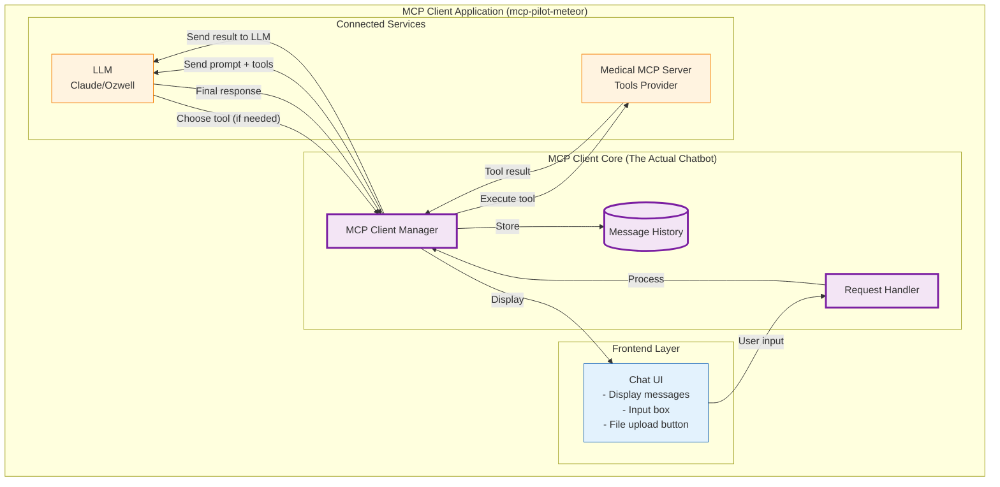

**MERMAID DIAGRAM: -**

# MCP Pilot - Intelligent Healthcare Chat Interface

A sophisticated Model Context Protocol (MCP) client application built with Meteor.js and React that provides intelligent tool selection and orchestration across multiple healthcare data systems. This application serves as a unified interface for Epic EHR, Aidbox FHIR, MongoDB Atlas and medical document processing systems.

## 🏥 Features

- **Intelligent Tool Selection**: AI-powered selection from 25+ healthcare tools across multiple MCP servers
- **Multi-Provider AI Support**: Anthropic Claude (native tool calling) and Ozwell Bluehive AI models  
- **Healthcare System Integration**: Epic EHR, Aidbox FHIR, and medical document processing
- **Session Management**: Persistent chat sessions with MongoDB storage and context tracking
- **Document Upload & Processing**: Upload medical documents with OCR, NER, and semantic search
- **Real-time Chat Interface**: Modern React-based chat UI with message streaming
- **Provider Switching**: Switch between AI providers seamlessly during conversations
- **Export/Import**: Export chat sessions and import them for sharing or backup
- **Responsive Design**: Mobile-friendly interface with collapsible sidebar
- **Theme Support**: Dark/light theme toggle with system preference detection

## 🚀 Quick Start

### Prerequisites

- Node.js 18.0.0 or higher
- MongoDB 4.4 or higher
- Meteor.js 3.0 or higher
- AI API keys (Anthropic Claude or Ozwell)
- Running MCP servers (Medical, Aidbox, Epic)

### Installation

```bash
# Clone the repository
git clone https://github.com/your-username/mcp-pilot-meteor.git
cd mcp-pilot-meteor

# Install Meteor (if not already installed)
curl https://install.meteor.com/ | sh

# Install dependencies
meteor npm install

# Setup environment configuration
cp settings-template.json settings.json
```

### Environment Configuration

Create a `settings.json` file:

```json
{
  "private": {
    "ANTHROPIC_API_KEY": "sk-ant-api-...",
    "OZWELL_API_KEY": "your-ozwell-key",
    "OZWELL_ENDPOINT": "https://api.ozwell.io/v1",
    "MEDICAL_MCP_SERVER_URL": "http://localhost:3001",
    "AIDBOX_MCP_SERVER_URL": "http://localhost:3002", 
    "EPIC_MCP_SERVER_URL": "http://localhost:3003",
    "MONGODB_URL": "mongodb://localhost:27017/mcp_pilot"
  },
  "public": {
    "APP_NAME": "MedQuery",
    "APP_VERSION": "1.0.0"
  }
}
```

### Running the Application

#### Development Mode
```bash
meteor run --settings settings.json
```

#### Production Mode
```bash
meteor build --directory ../build
cd ../build/bundle/programs/server
npm install
MONGO_URL=mongodb://localhost:27017/mcp_pilot \
ROOT_URL=http://localhost:3000 \
METEOR_SETTINGS="$(cat ../../../../../../settings.json)" \
node main.js
```

## 🔧 Architecture Overview

### Core Components

```
mcp-pilot-meteor/
├── client/
│   ├── main.tsx              # Client entry point
│   └── components/
│       ├── custom/           # Custom UI components
│       └── ui/               # Base UI components
├── server/
│   └── main.ts               # Server initialization
├── imports/
│   ├── api/
│   │   ├── mcp/              # MCP client management
│   │   ├── messages/         # Chat message handling
│   │   └── sessions/         # Session management
│   └── ui/
│       ├── App.tsx           # Main application component
│       └── Chat.tsx          # Chat interface
├── public/
└── package.json
```

### MCP Server Connections

The application connects to multiple MCP servers:

- **Medical MCP Server** (Port 3001): Document processing, OCR, NER, semantic search
- **Aidbox MCP Server** (Port 3002): FHIR operations with create/read/update capabilities  
- **Epic MCP Server** (Port 3003): Epic EHR integration with JWT authentication

### AI Provider Architecture

#### Anthropic Claude (Recommended)
- **Native Tool Calling**: Direct integration with Claude's tool calling API
- **Models**: Claude 3.5 Sonnet, Claude 3 Haiku
- **Features**: Advanced reasoning, multi-step tool orchestration
- **Best For**: Complex medical workflows requiring multiple tool interactions

#### Ozwell Bluehive AI
- **Intelligent Prompting**: Custom prompt engineering for tool selection
- **Models**: Various Bluehive models via Ozwell API
- **Features**: Alternative provider for Claude-compatible workflows
- **Best For**: Cost-effective alternative with competitive performance

## 📊 Available Tools & Capabilities

### Epic EHR Tools (6 tools)
- Patient search and demographics
- Clinical observations and lab results
- Medication history and prescriptions
- Medical conditions and diagnoses
- Healthcare encounters and visits

### Aidbox FHIR Tools (12 tools)
- Full CRUD operations for patients
- Observations, medications, conditions
- Healthcare encounters
- Complete FHIR R4 resource management

### Medical Document Tools (10 tools)
- Document upload with OCR processing
- Medical entity recognition (NER)
- Semantic search and similarity matching
- Patient history analysis
- Medical insights and recommendations

## 🖥 User Interface

### Chat Interface
- **Message Streaming**: Real-time response streaming from AI providers
- **Tool Execution Feedback**: Visual indicators when tools are being executed
- **Rich Message Display**: Support for structured data, tables, and medical entities
- **Context Awareness**: Maintains conversation context across tool interactions

### Session Management
- **Persistent Sessions**: All conversations stored in MongoDB
- **Session Sidebar**: Browse and switch between chat sessions
- **Auto-titling**: Automatic generation of descriptive session titles
- **Export/Import**: JSON-based session backup and sharing

### Provider Switching
- **Real-time Switching**: Change AI providers mid-conversation
- **Provider Status**: Visual indicators showing current provider and capabilities
- **Graceful Fallback**: Automatic fallback to available providers

## 🔐 Security & Authentication

### API Key Management
- Server-side storage of sensitive API keys
- Environment-based configuration
- No client-side exposure of credentials

### Session Security
- MongoDB-based session storage
- Automatic session cleanup
- Context isolation between users

### Healthcare Data Protection
- HIPAA-compliant data handling patterns
- Secure communication with MCP servers
- No persistent storage of sensitive patient data in client

## 📱 Usage Examples

### Starting a Conversation
```
User: "Find patients with diabetes and hypertension"

AI: I'll search for patients with both diabetes and hypertension using our healthcare systems.

[Executes: epicSearchPatients with condition filters]
[Executes: aidboxSearchPatients with diagnosis criteria]

Found 15 patients matching your criteria across Epic and Aidbox systems...
```

### Document Processing
```
User: "Upload this lab report and extract the key findings"

AI: I'll process your lab report and extract the medical entities.

[Executes: uploadDocument with OCR processing]
[Executes: extractMedicalEntities for lab values]

Processed lab report successfully. Key findings:
- Total Cholesterol: 245 mg/dL (HIGH)
- LDL: 160 mg/dL (HIGH)  
- HDL: 35 mg/dL (LOW)
- Triglycerides: 180 mg/dL (BORDERLINE HIGH)
```

### Multi-System Analysis
```
User: "Compare patient outcomes for heart failure treatments"

AI: I'll analyze heart failure treatment outcomes across our data sources.

[Executes: findSimilarCases for heart failure patients]
[Executes: epicGetPatientMedications for treatment data]
[Executes: analyzePatientHistory for outcome trends]

Analysis complete. Heart failure treatment comparison...
```

## 🛠 Development

### Scripts

```bash
# Start development server
meteor run --settings settings.json

# Build for production
meteor build --directory ../build

# Run tests
meteor test --settings settings.json

# Reset database
meteor reset

# Add packages
meteor add package-name

# Update dependencies
meteor npm update
```

### Adding New MCP Servers

1. **Create Connection Class**:
```typescript
// imports/api/mcp/newServerConnection.ts
export class NewServerConnection {
  // Implement MCP protocol connection
}
```

2. **Register in MCPClientManager**:
```typescript
// imports/api/mcp/mcpClientManager.ts
public async connectToNewServer(): Promise<void> {
  // Add connection logic
}
```

3. **Update Server Initialization**:
```typescript
// server/main.ts
await mcpManager.connectToNewServer();
```

### Customizing AI Providers

Add new providers in `mcpClientManager.ts`:
```typescript
private async processWithNewProvider(query: string, context?: any): Promise<string> {
  // Implement provider-specific logic
}
```

## 📊 Monitoring & Analytics

### Health Checks
- MCP server connectivity monitoring
- AI provider status checking
- Database connection verification

### Usage Analytics  
- Tool usage frequency tracking
- Session duration metrics
- Error rate monitoring

### Performance Metrics
- Response time tracking
- Tool execution performance
- AI provider latency comparison

## 🔍 Troubleshooting

### Common Issues

1. **MCP Server Connection Failures**
   ```bash
   # Check server status
   curl http://localhost:3001/health
   curl http://localhost:3002/health  
   curl http://localhost:3003/health
   ```

2. **AI Provider Errors**
   - Verify API keys in settings.json
   - Check provider rate limits
   - Validate endpoint URLs

3. **Database Connection Issues**
   ```bash
   # Check MongoDB status
   mongosh mongodb://localhost:27017/mcp_pilot
   ```

4. **Tool Execution Failures**
   - Check MCP server logs
   - Verify tool parameter formats
   - Test individual tool endpoints

### Debug Mode

Enable debug logging:
```bash
export MCP_DEBUG=true
meteor run --settings settings.json
```

## 📄 Package Dependencies

Key dependencies from `package.json`:

```json
{
  "dependencies": {
    "@anthropic-ai/sdk": "^0.53.0",
    "@modelcontextprotocol/sdk": "^1.13.1",
    "react": "^18.2.0",
    "react-dom": "^18.2.0",
    "react-router-dom": "^6.28.0",
    "framer-motion": "^11.11.13",
    "lucide-react": "^0.456.0",
    "@radix-ui/react-dialog": "^1.1.2",
    "tailwind-merge": "^2.5.4",
    "uuid": "^11.0.3"
  }
}
```

## 🐳 Docker Deployment

### Dockerfile
```dockerfile
FROM geoffreybooth/meteor-base:2.15

# Copy package files
COPY package*.json ./
RUN meteor npm ci --production

# Copy application code  
COPY . ./

# Build the application
RUN meteor build --directory /app --server-only

WORKDIR /app/bundle/programs/server
RUN npm install

EXPOSE 3000

CMD ["node", "main.js"]
```

### Docker Compose
```yaml
version: '3.8'

services:
  mcp-pilot:
    build: .
    ports:
      - "3000:3000"
    environment:
      - MONGO_URL=mongodb://mongo:27017/mcp_pilot
      - ROOT_URL=http://localhost:3000
    depends_on:
      - mongo
      - medical-mcp
      - aidbox-mcp
      - epic-mcp
    volumes:
      - ./settings.json:/app/settings.json

  mongo:
    image: mongo:7
    ports:
      - "27017:27017"
    volumes:
      - mongo-data:/data/db

  medical-mcp:
    build: ../medical-mcp-server
    ports:
      - "3001:3001"
    depends_on:
      - mongo

  aidbox-mcp:
    build: ../aidbox-mcp-server  
    ports:
      - "3002:3002"

  epic-mcp:
    build: ../epic-mcp-server
    ports:
      - "3003:3003"

volumes:
  mongo-data:
```

## 🚀 Deployment

### Production Deployment

1. **Build Application**:
```bash
meteor build --directory ../production --server-only
```

2. **Deploy Bundle**:
```bash
cd ../production/bundle
npm install
```

3. **Configure Environment**:
```bash
export MONGO_URL=mongodb://production-db:27017/mcp_pilot
export ROOT_URL=https://your-domain.com
export METEOR_SETTINGS="$(cat settings.json)"
```

4. **Start Application**:
```bash
node main.js
```

### Environment Variables

Required production environment variables:
- `MONGO_URL`: MongoDB connection string
- `ROOT_URL`: Application root URL
- `METEOR_SETTINGS`: JSON string of settings
- `PORT`: Server port (default: 3000)

## 📄 License

MIT License - see [LICENSE](LICENSE) file for details.

## 🤝 Contributing

1. Fork the repository
2. Create a feature branch (`git checkout -b feature/amazing-feature`)
3. Commit your changes (`git commit -m 'Add amazing feature'`)
4. Push to the branch (`git push origin feature/amazing-feature`)
5. Open a Pull Request

## 📞 Support

- **Meteor Documentation**: [Meteor Guide](https://guide.meteor.com/)
- **React Documentation**: [React Docs](https://react.dev/)
- **Model Context Protocol**: [MCP Documentation](https://modelcontextprotocol.io/)
- **Issues**: [GitHub Issues](https://github.com/KalyankumarKonduru/mcp-pilot-meteor/issues)

## 🔗 Related Projects

- [Medical MCP Server](https://github.com/KalyankumarKonduru/MCP-Server) - Document processing and NER
- [Aidbox MCP Server](https://github.com/KalyankumarKonduru/Aidbox) - Aidbox FHIR integration  
- [Epic MCP Server](https://github.com/KalyankumarKonduru/Epic-MCP) - Epic EHR integration

---

**Note**: This application is designed for healthcare environments and requires proper setup of all MCP servers for full functionality. Ensure compliance with healthcare regulations when handling real patient data.
